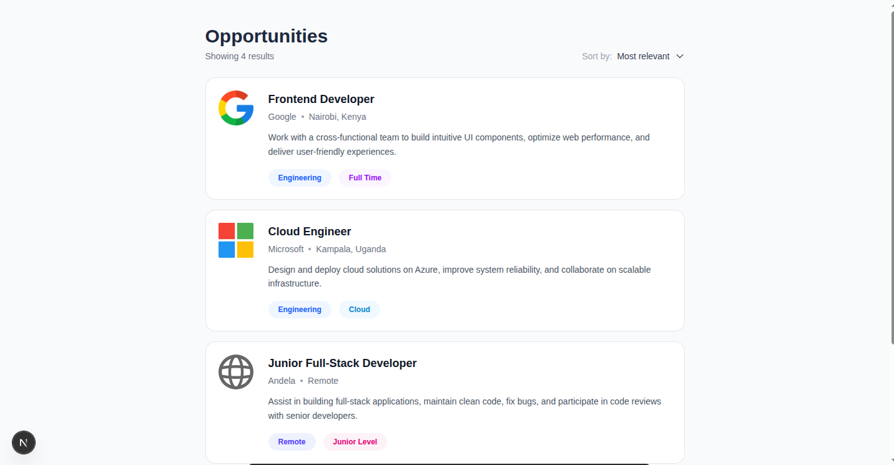
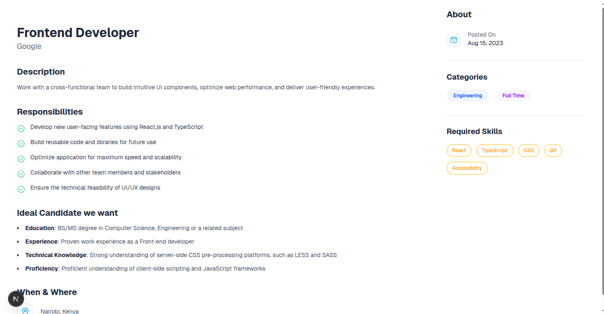

## Job Listing Application

A simple job listing application built with **Next.js**, **TypeScript**, and **Tailwind CSS**.
The app displays a list of job opportunities and a detailed job description dashboard.

### **Opportunities Page**

Shows all available job listings.
Each job card includes:

* Company logo
* Job role & company
* Location
* Short description
* Category tags



---

### **Job Description Dashboard**

A detailed page containing:

* Job description
* Responsibilities list
* Ideal candidate section
* When & Where section
* Sidebar with About, Categories, and Required Skills



---

## Installation & Setup

```bash
git clone https://github.com/kibalamaa/job.git
cd job
npm install
npm run dev
```
