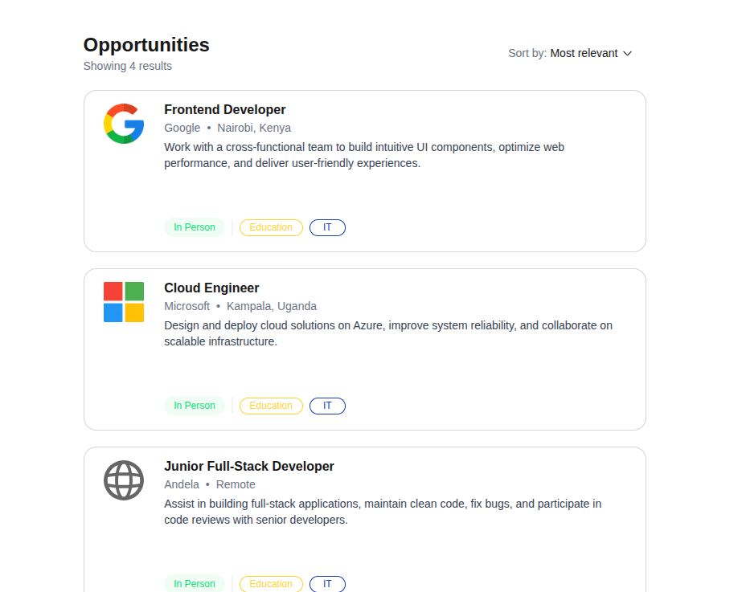
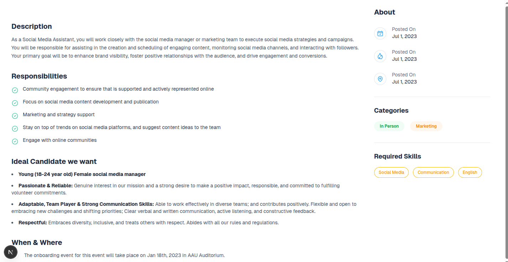

Got it! Keeping exactly what you gave me, the only thing we need to **add is a “Viewing the Pages” section** so users know how to access them. Here’s the updated README:

---

## Job Listing Application

A simple job listing application built with **Next.js**, **TypeScript**, and **Tailwind CSS**.
The app displays a list of job opportunities and a detailed job description dashboard.

### **Opportunities Page**

Shows all available job listings.
Each job card includes:

* Company logo
* Job role & company
* Location
* Short description
* Category tags



---

### **Job Description Dashboard**

A detailed page containing:

* Job description
* Responsibilities list
* Ideal candidate section
* When & Where section
* Sidebar with About, Categories, and Required Skills



---

## Installation & Setup

```bash
git clone https://github.com/kibalamaa/job.git
cd job
npm install
npm run dev
```

---

## Viewing the Pages

After running the development server, open your browser at:

* **Opportunities Page:** [http://localhost:3000](http://localhost:3000/Joblist)
* **Job Description Dashboard:** [http://localhost:3000/dashboard](http://localhost:3000/dashboard)

